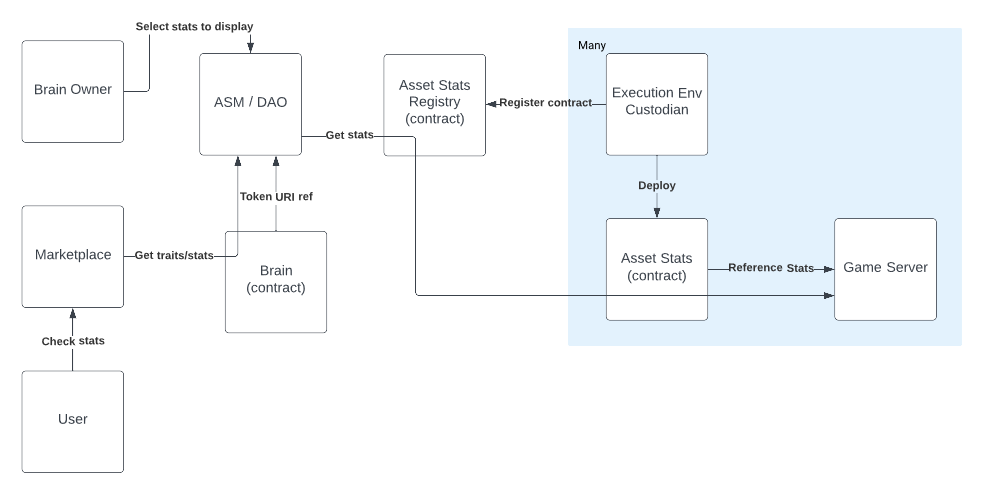

# Asset Stats Regsitry Specification

Status:

- [ ] DRAFT
- [x] APPROVED
- [x] SUBMITTED
- [ ] AUDITED
- [ ] PASSED & PUBLIC

## General

Each asset MAY be used in different execution environments. As it is used it will accumulate statistics. The [Asset Stats Specification](as_spec.md) defines an interface for exposing these statistics for a given environment. The Asset Stats Registry is a way to combine stats across multiple environments.

## Registration

When registering an address the contract SHOULD validate that the address is a contract that conforms to the Asset Stats specification.

The contract MUST return an identifier that will remain constant for this address.

The contract MUST emit a `RegistryEntryAdded` event when an address is added. The contract MUST emit a `RegistryEntryRemoved` event when an address is removed.

## Read Methods

The `getRegistryEntry` function MUST revert if the index provided is invalid.

`isActive` MAY perform additional logic checks to determine if a registered address is valid. This caters for streaming payments while registered.

`listActiveStatsAddresses` MUST iterate through all actively registered addresses.

## Implementation

ASM offers two implementations of the contract. A simple implementation and an implementation that requires payment for registration.
