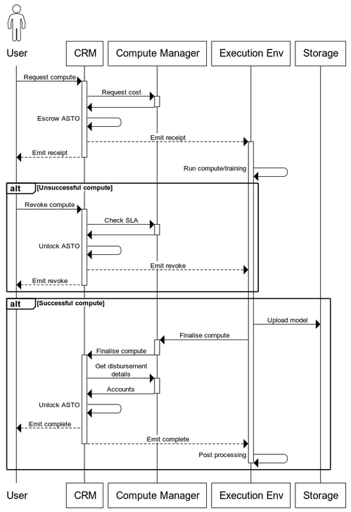

# Compute Request Manager Flow

Status:

- [ ] DRAFT
- [x] APPROVED
- [x] SUBMITTED
- [ ] AUDITED
- [ ] PASSED & PUBLIC

## Request Compute

A user makes a `requestCompute` request.
The user selects which Compute Manager to interface with, which `optionId` to call, how many units of compute and an identifying (off-chain) hash.

- The Compute Request Manager calls the Compute Manager `getComputeOptionUnitCost` to determine the ASTO (ERC20) cost of the request.
- The Compute Request Manager holds that amount of the user's ASTO in escrow.
- The Compute Request Manager emits a `ComputeRequested` event.

## Revoke Compute

The Compute Manager exposes an SLA calculation function.
If a compute request is not completed within the SLA, the user is able to revoke the request by calling `revokeCompute`.

- The Compute Request Manager checks the Compute Manager SLA `getComputeOptionSLA` for the `computeId`.
- The Compute Request Manager will return ASTO held in escrow to the user.
- The Compute Request Manager emits a `ComputeRevoked` event.
- The Compute Request Manager marks the compute request completed to prevent replay attacks.

## Complete Compute

The Compute Manager is able to call `completeCompute` on the Compute Request Manager to have ASTO disbursed.
There is no validation that the requested compute (off-chain) has been completed.
The Compute Manager interface does not define the `completeCompute` function signature, as the Compute Manager may have specific requirements for marking a compute request as complete.

- The Compute Manager calls the Compute Request Manager with the `computeId` of a compute request made against the Compute Manager's address.
- The Compute Request Manager takes a fee for the DAO.
- The Compute Request Manager requests the Compute Manager disbursement details `getComputeOptionDisbursement`.
- The Compute Request Manager disburses the remaining ASTO that was held in escrow.
- The Compute Request Manager emits a `ComputeCompleted` event.
- The Compute Request Manager marks the compute request completed to prevent replay attacks.

## Claim ASTO

Once ASTO has been disbursed, it is held by the Compute Request Manager contract.
Addresses can claim the ASTO using the `claimAsto` function.

## Stake ASTO

An address is able to add ASTO to their balance held by the Compute Request Manager.
A user may do this to reduce gas costs when making requests.
A Compute Manager may do this to subsidize compute requests (when `getComputeOptionUnitCost` does not cover the DAO fee).
