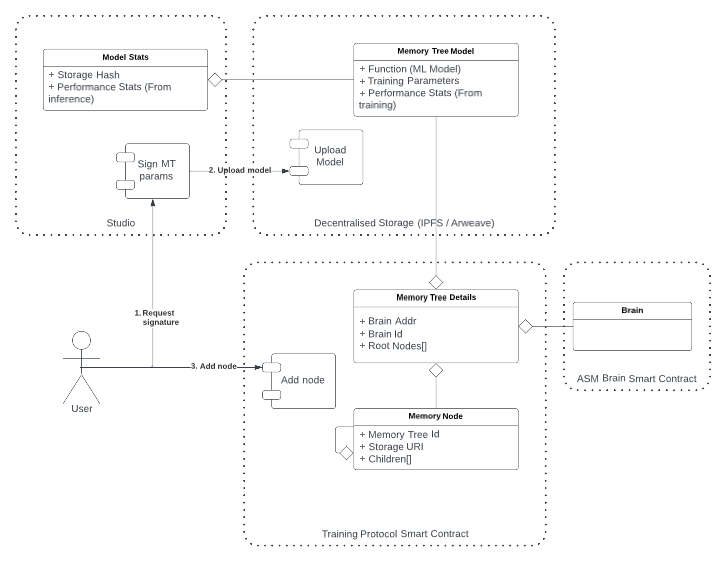

# Overview

Status:

- [ ] DRAFT
- [x] APPROVED
- [x] SUBMITTED
- [ ] AUDITED
- [ ] PASSED & PUBLIC

## ASM Core Protocol

The ASM Core Protocol defines a collection of interfaces and flows to facilitate decentralised compute across the open web.

The Compute Request Manager will be deployed and owned by ASM (and eventually the DAO).
Other contracts in the protocol are to be deployed and owned by Compute Custodians (creators, game studios and integraters).
We provide a number of sample implementations in the `samples` folder.

## Components

### Compute Request Manager

The Compute Request Manager is responsible for maintaining the value flow associated with compute requests.
This will be deployed and owned by ASM (and eventually the DAO).

The Compute Request Manager takes requests for compute from users, stores ASTO (ERC20) in escrow for payment and emits an event.
The infrastructure providers will listen for events and process the request, then complete the request on chain.
Completing the request will disperse the ASTO to the required parties and mark the compute request complete.
If a compute request fails to be processed in time, the user is able to revoke the request to return their ASTO.

### Compute Manager

A Compute Manager is a Compute Custodian owned contract which provides configuration parameters associated to requests for compute on their execution environments.
The Compute Manager determines the function for ASTO price calculations, SLA time for request completion, and ASTO disbursement on completion.

We provide 3 sample implementations:

- `ComputeManagerSimple` - A simple implementation
- `ComputeManagerUSDC` - Calculates price from a USDC peg using a Uniswap LP
- `ComputeManagerVerified` - Allows server signed callers to complete a request and recieve ASTO

### Memory Tree

Memory Trees contain point in time references to assets and cater for machine learning models.

Each node usually (but not always) represents the result of a compute/training request via the Compute Request Manager.
The parent/child relationship between nodes shows when an AI is iterated upon through a machine learning training (or other) event.

The memory tree contract is owned by a Compute Custodian, as the models within the memory tree nodes are tightly coupled to an execution environment.
Memory trees and their nodes are owned by the brain (ERC721) and therefore the brain owner.
Ergo, when a brain is transferred to a new owner, the memory tree is transferred with it.

### Asset Stats

Asset Stats are a way to expose information for assets, closing the value loop.

As an asset (e.g. ERC721 ASM brain) is used in an execution environment, it will collect performance statistics.
These statistics are exposed by the Compute Custodian (execution environment owner).
The Compute Custodian deploys and manages an implementation of the Asset Stats interface to expose the URL for these stats.

**Note: There is ongoing technical discussion on the Asset Stats implementation. This may be included in another workstream.**

### Asset Stats Registry

An Asset Stats Registry is a mechanism to capture all Asset Stats contract deployed on the network.
Futureverse will

Once the Asset Stats contract is deployed, a request can be made to include the contract in the registry.
The registry owner will use the registry to collate stats across multiple experiences and provide (off-chain) a combined view for a given asset.

**Note: There is ongoing technical discussion on the Asset Stats Registry implementation. This may be included in another workstream.**
