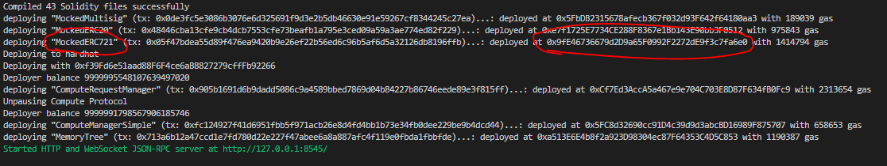
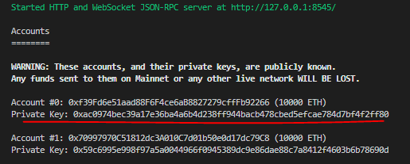
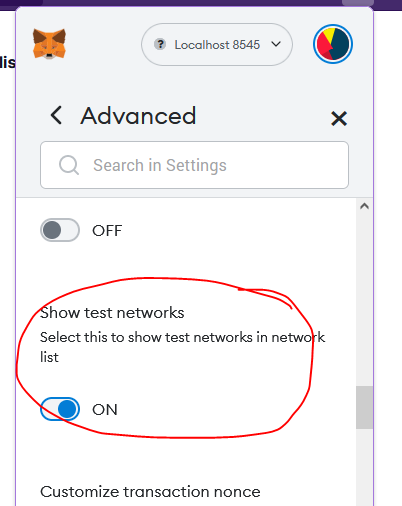

# Example Core Protocol Integration

This folder contains an example integration with the Core Protocol.
A complete walk through can be found on confluence:
<https://alteredstatemachine.atlassian.net/wiki/spaces/PAD/pages/499810917/Integration+Guide>

This example runs a local blockchain and servers to run a trivial "game" implementation that is integrated with the Core Protocol.

Note that the code in this example is not production ready.
Points are made where enhancements can be made to productionise this resource.

- [Example Core Protocol Integration](#example-core-protocol-integration)
  - [Usage](#usage)
    - [Start a local blockchain](#start-a-local-blockchain)
      - [Use scripts to make txs](#use-scripts-to-make-txs)
    - [Run the example](#run-the-example)
      - [Use the UI to make requests](#use-the-ui-to-make-requests)
      - [Use postman to make requests](#use-postman-to-make-requests)
  - [Game Server](#game-server)
  - [Listener](#listener)
    - [Productionised Listener](#productionised-listener)
    - [Productionised Game Server](#productionised-game-server)

## Usage

### Start a local blockchain

**This section runs from the project root directory.**

Install dependencies with `yarn`.

Copy `.env.example` to `.env`.

Start a local blockchain, create a list of account and deploy all contracts with `yarn start:e2e`.

Keep this command line window open to keep your blockchain running.

You can find the deployed contract addresses in the output.



Optionally, grab a public/private key from the output and load it into your Metamask for testing.



#### Use scripts to make txs

**This section runs from the project root directory.**

_These scripts use Account #0 to submit transactions. You can see this address in the output when starting the blockchain locally._

_You will need to run these scripts to give your account ASTO, ETH and tokens in order to use the demo application._

Give your address some ETH with `yarn hardhat --network localhost send-eth --address XXX --amount 1`.
Give your address some ASTO with `yarn hardhat --network localhost give-asto --address XXX --amount 100`.
Give your address a Brain with `yarn hardhat --network localhost give-brain --address XXX`.

Allow the Core Protocol to spend your ASTO with `yarn hardhat --network localhost update-crm-allowance --amount 100`.

### Run the example

**This section runs from the `example` directory.**

Install dependencies with `yarn`.

Copy `.env.example` to `.env` and update with your values.

Run the demo with `yarn start`.

This will start the game server (which also serves the front end) and the blockchain listener (which also runs "AI training").

#### Use the UI to make requests

Open <http://localhost:8000> in your browser.

_Note the UI does not automatically update. Refresh to see any updated values._

Connect your wallet. Make sure you are corrected to the right network (localhost).
If you don't have localhost as an option, you can add it from the Metamask settings like so:



```yaml
Network name: Localhost 8545
New RPC URL: http://localhost:8545
Chain ID: 31337
Currency symbol: ETH
```

If you don't have enough ASTO or ETH or brains, use the scripts above.

Update the approved amount of ASTO the Compute Request Manager can access, click `Update` and submit the transaction.

Select the brain to train and the amount of compute units.
_Note For this example, 1 compute unit will cost 1 ASTO._

Once you refresh the page, you will see the new memory node that has been trained.
You can now "Pin" this memory to the Memory Tree, which will store the reference permanently on chain.

In this example, you can only train against pinned memories.
While this is recommended, but not a hard requirement for production systems.

#### Use postman to make requests

[Postman](https://www.postman.com/) is an API platform tool which is useful for collating requests.
We use Postman to call the backend game application.

Open Postman and load the collection at `postman_collection.json`.

Create an environment with variables:

- `game-url` (<http://localhost:8000>)
- `brain-addr` (The deployed ERC721 address)
- `brain-id` (The id of an ERC721 you have created. Probably 0)

Run requests as required.

## Game Server

`game.ts` is an example game server.

The game server uses `express` to provide API endpoints and serve the ABI and UI files.

The API exposes endpoints for:

- Getting and setting asset / model information
- Saving a request for compute and providing a hash for the blockchain interaction

The UI is built with Vanilla Javascript. This was chosen to reduce bloat in the repo and can easily be replaced with React etc.

## Listener

`listener.ts` is a blockchain event monitoring and handling service.

When an event is trigger, the listener will do the following:

1. Retrieve the stored compute request from the server
2. Run training. (In this example training will increment `units` and `power`)
3. Update the model (memory tree nodes TBA)
4. Mark training completed

### Productionised Listener

Replace this service with [the Global Chain Sync Service](https://alteredstatemachine.atlassian.net/wiki/spaces/AI/pages/498467004/Global+Block+Event+Monitoring+AKA+Global+Chain+Sync+Service).

### Productionised Game Server

Use React or some other mature framework for the frontend.

Consider authentication when interacting with endpoints.
